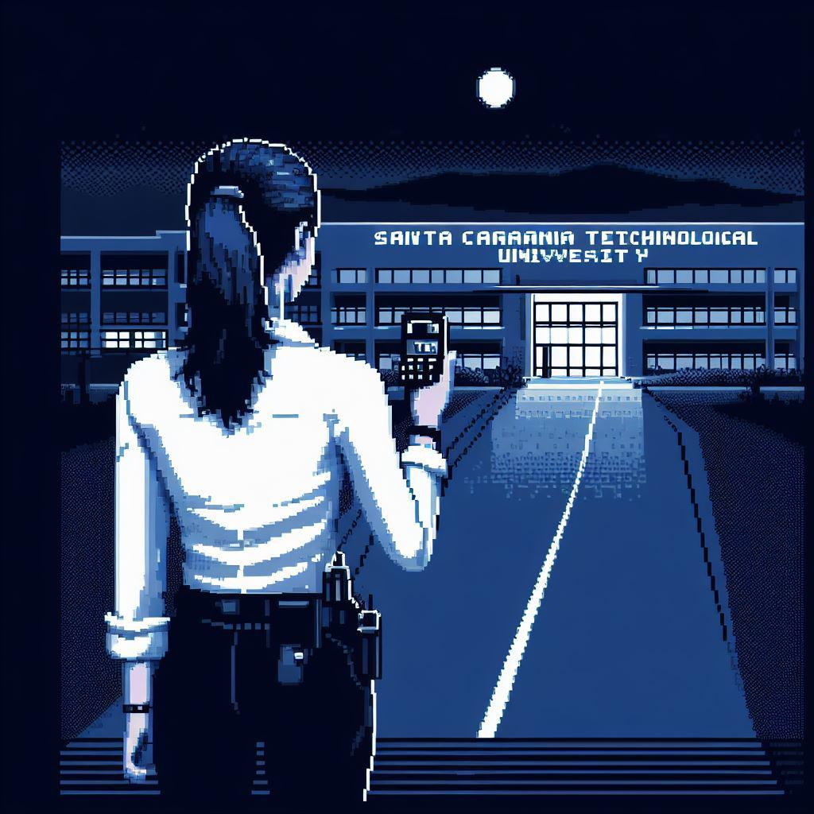
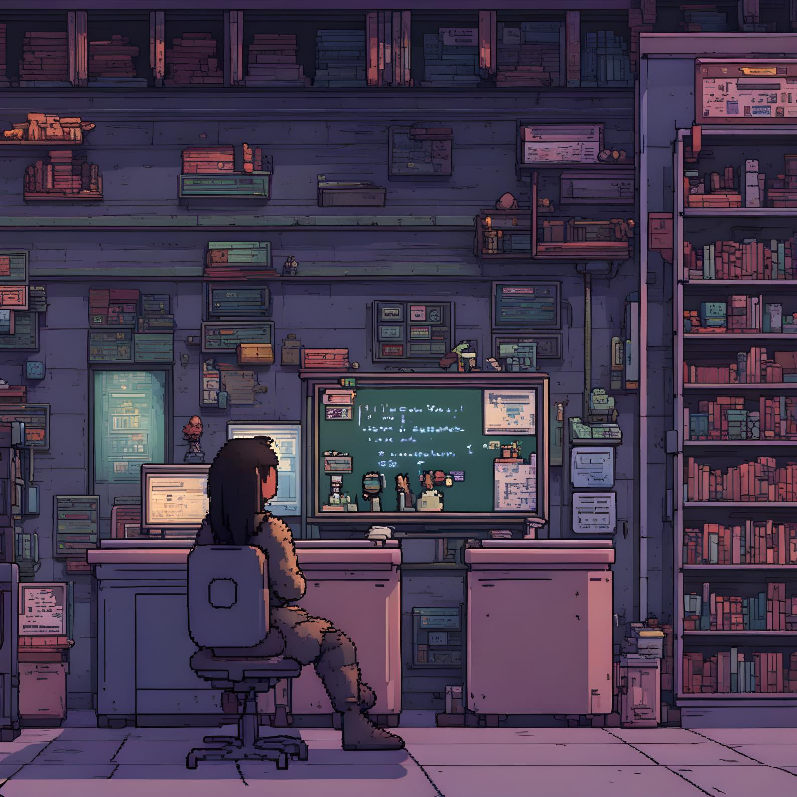
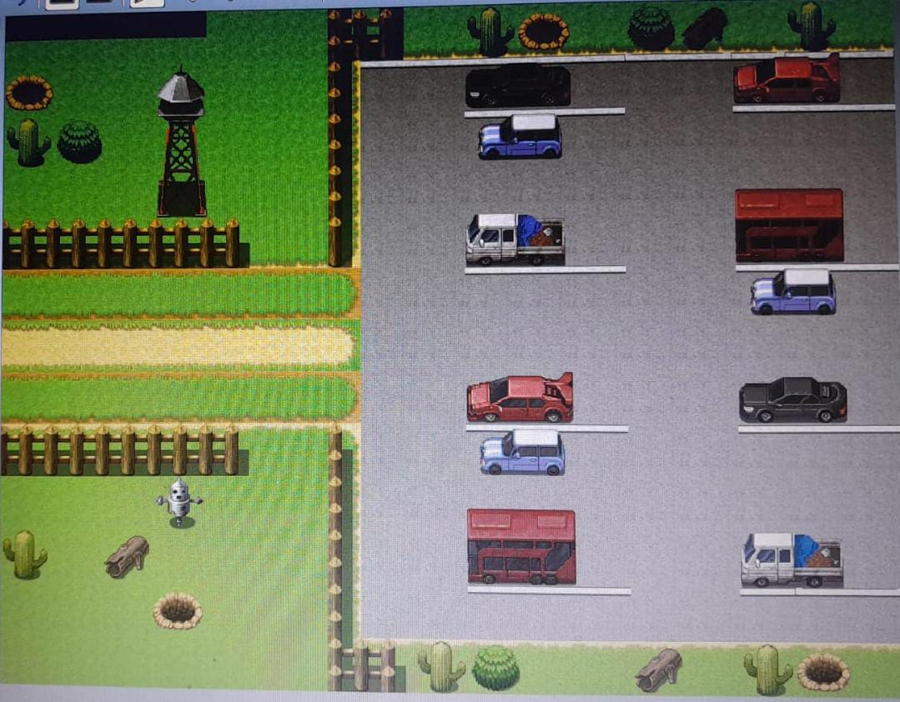

<!doctype html>
<html lang="es">

<head>
  <meta charset="utf-8">
  <meta name="viewport" content="width=device-width, initial-scale=1">
  <title>El Enigma de la Universidad repuesto</title>
  <link href="https://cdn.jsdelivr.net/npm/bootstrap@5.3.2/dist/css/bootstrap.min.css" rel="stylesheet"
    integrity="sha384-T3c6CoIi6uLrA9TneNEoa7RxnatzjcDSCmG1MXxSR1GAsXEV/Dwwykc2MPK8M2HN" crossorigin="anonymous">
  <link rel="stylesheet" href="https://cdn.jsdelivr.net/npm/bootstrap-icons@1.7.2/font/bootstrap-icons.css">
  <link rel="stylesheet" href="css/estilos.css">
</head>

<body>
  <header>
    

      <nav class="navbar navbar-expand-lg navbar-dark bg-dark fixed-top " data-bs-theme="dark">
        

          <a href="#" class="navbar-brand"> TheGalaxy</a>
          <button class="navbar-toggler" type="button" data-bs-toggle="collapse"
            data-bs-target="#navbarSupportedContent" aria-controls="navbarSupportedContent" aria-expanded="false"
            aria-label="Toggle navigation">
            
          </button>
          

            <ul class="navbar-nav ms-auto mb-2 mb-lg-0">
  
              </li>
              <li class="nav-item">
                <a href="#aboutus" class="nav-link">About us</a>
              </li>
              <li class="nav-item">
                <a href="#ournetworks" class="nav-link">Our Networks</a>
              </li>
             
              </li>
              <li class="nav-item">
                <a href="#creators" class="nav-link">Creators and Roles</a>
              </li>
             
            </ul>

          

        

      </nav>
      

    

  </header>

  

    

      <button type="button" data-bs-target="#carouselE" data-bs-slide-to="0" class="active" aria-current="true" 
      aria-label="Slide 1"></button>
      <button type="button" data-bs-target="#carouselE" data-bs-slide-to="1" aria-current="true"
        aria-label="Slide 2"></button>
      <button type="button" data-bs-target="#carouselE" data-bs-slide-to="2" aria-current="true"
        aria-label="Slide 3"></button>
    

    

      

        
        

          <h5>The enigma of the University</h5>
          
Would you dare to investigate?

          <a href="#information" class="btn btn-primary mt-3 bg-dark">More information</a>
        

      

      

        
        

        

      

      

        
        

        

      

    

    <button class="carousel-control-prev" type="button"
    data-bs-target="#carouselE"
    data-bs-slide="prev"
    >
      
      Previous
    </button>
    <button class="carousel-control-next" type="button" data-bs-target="#carouselExampleCaptions" data-bs-slide="next">
      
      Next
    </button>
  

  

  </section>
  <section class="Nosotros my-5" id="aboutus">
    <h2 class="text-center text-white my-5">About us</h2>
    

      

        

          
We are a small group of people from a University in the municipality

          
 from Santa Catarina, in the state of Monterrey Nuevo León

          
We are looking to promote our Demo of a video game themed to the University where we are studying

          
The name of our game is "The Enigma of the University", and it is related to a story that has been
            circulating for some time that
            at the university at a certain time of day a girl usually appears.

        

        

          
        

      

    

    <section class="Nosotros my-5" id="information">
      <h2 class="text-center text-white my-5">Game Related</h2>
      

        

          

            
Daniela, a young security guard struggling with financial problems, delves into her new night job at the Technological University. The university, 
              far from being abandoned, is silent at night, making it the perfect place for Daniela.

               
              
Everything changes when he discovers a ghost girl in one of the hallways. Initially, the girl 
                seems harmless and in need of help. Daniela feels compassion and decides to investigate further.

               
            
Players take on the role of Daniela and must explore the university in search of answers.
               As they progress, they discover dark secrets about the history of the college and the ghost girl. They must make 
              important decisions that will affect the course of history and Daniela's destiny.

               
              
"Night's Watch" combines RPG elements, such as skill upgrading and item collecting, 
                with a growing sense of tension and mystery. Players must face supernatural challenges 
                and solve puzzles to unravel the riddle of the university.

          

          

            
          

        

      

    </section>
  </section>
  <section class="services section pading  " id="ournetworks">

    

      

        

          

            <h2>Our Networks</h2>
            

              In this section you will find some of our platforms   
              where you can find out about new updates
            

          

        

      

      

        

          

            

              <i class="bi bi-discord"></i>
              <h3 class="card-title">Discord</h3>
              

                Join the Discord Community more information or questions
              

              <a class="discord" href="https://discord.gg/4wGxfYrE">More information </a>
            

          

        

        

          

            

              <i class="bi bi-whatsapp"></i>
              <h3 class="card-title">Whatsapp</h3>
              

                Join the WhatsApp Group for more information or questions
              

              <a class="whatsapp" href="https://chat.whatsapp.com/L8TPEpwkwDuCRei1uLRAqz">More information </a>
            

          

        

        

          

            

              <i class="bi bi-instagram"></i>
              <h3 class="card-title">instagram</h3>
              

                Join the WhatsApp Group for more information or questions and new characters
              

              <a class="instagram" href="https://instagram.com/thegalaxy_of?igshid=MWlsenJvaWQ3bThoMA==">More information </a>
            

          

        

      

    

  </section>

  <section class="team section-padding" id="creators">
    

      

        

          

            <h2>Creators and Roles</h2>

            
Meet those responsible for the creation of this game idea

          

        

      

      

        

          

            

              
              <h3 class="card-title py-2">Brayan Alejandro Castillo Alanis </h3>
              

                <i class="bi bi-send"></i>Design  
                <i class="bi bi-send"></i>Page creation  
                <i class="bi bi-send"></i>mobile design 
                <i class="bi bi-send"></i>Mobile app creation 
                <i class="bi bi-send"></i>Video game creation
              

            

          

        

        

          

            

              
              <h3 class="card-title py-2">Alan Joaquin Flores Diaz </h3>
              

                <i class="bi bi-send"></i>Design  
                <i class="bi bi-send"></i>Page creation  
                <i class="bi bi-send"></i>mobile design 
                <i class="bi bi-send"></i>Mobile app creation 
                <i class="bi bi-send"></i>Video game creation
              

            

          

        

        

          

            

              
              <h3 class="card-title py-2">Kevin Orlando Guzman Reyes </h3>
              

                <i class="bi bi-send"></i>Design  
                <i class="bi bi-send"></i>Page creation  
                <i class="bi bi-send"></i>mobile design 
                <i class="bi bi-send"></i>Mobile app creation 
                <i class="bi bi-send"></i>Video game creation
              

            

          

        

        

          

            

              
              <h3 class="card-title py-2">Sergio Daniel de la Cruz </h3>
              

                <i class="bi bi-send"></i>Design  
                <i class="bi bi-send"></i>Page creation  
                <i class="bi bi-send"></i>mobile design 
                <i class="bi bi-send"></i>Mobile app creation 
                <i class="bi bi-send"></i>Video game creation
              

            

          

        

      

    

    

  </section>

  <footer class="text-center text-white py-3">
    &copy; The Galaxy - All rights reserved
  </footer>
  
</body>

</html>
